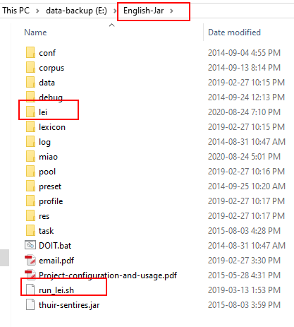

# Sentires-Guide
A quick guide to Sentires: Phrase-level Sentiment Analysis toolkit
- Zhang, Yongfeng, et al. [Do users rate or review? boost phrase-level sentiment labeling with review-level sentiment classification](http://yongfeng.me/attach/bps-zhang.pdf). SIGIR'14.

To obtain this tool, please check [Sentires](https://github.com/evison/Sentires).

## Motivation
The tool is very meaningful to the IR community, as many research works are built on top of its results. However, it may be difficult to obtain (feature, opinion, sentence, sentiment) quadruples from user reviews, since it did not have such a function in the first place. Moreover, nowadays people are usually more familiar with Python rather than Java on which this tool was developed. Therefore, here we present our data processing steps (mostly in Python) in the following paper to help researchers quickly obtain the aforementioned quadruples from user reviews.
- Lei Li, Yongfeng Zhang, Li Chen. Generate Neural Template Explanations for Recommendation. CIKM'20. \[[Paper](https://lileipisces.github.io/files/CIKM20-NETE-paper.pdf)\] \[[Code](https://github.com/lileipisces/NETE)\]

**A small ecosystem for Recommender Systems-based Natural Language Generation is available at [NLG4RS](https://github.com/lileipisces/NLG4RS)!**

## Creation Steps

- Place the folder [lei](lei/) in the tool's folder "English-Jar" as shown above.
- Modify [0.format.py](lei/0.format.py), including data path (line 5), the keys (line 12, 13, 16, 20, 21, 23) and how you load the data and iterate over each review (line 9), so that your datasets can be processed in the right format of the tool's input. Remove line 12-15, if your dataset has no summary or tip, which is meant to include as much textual data as possible.
- Update the absolute paths (line 65, 78, 94, 95) in [4.lexicon.linux](lei/4.lexicon.linux) accordingly.
- Run the commands in [run_lei.sh](lei/run_lei.sh) one by one (do not run this script, otherwise it may throw errors)

## Friendly reminder
Memory error might be fixed by specifying the memory allocation of JVM, e.g., ```java -jar -Xmx200G thuir-sentires.jar -t lexicon -c lei/4.lexicon.linux >> log.txt```

## Results
You will find a file "reviews.pickle" in [lei/output/](lei/output/), which is a python list, where each element is a python dict with the following keys:
```
'user',
'item',
'rating',
'text',
'sentence' # a list of tuples and each tuple looks like (feature, adjective, sentence, score)
```
